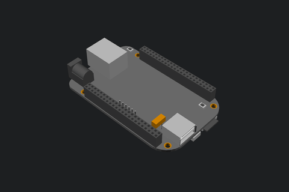
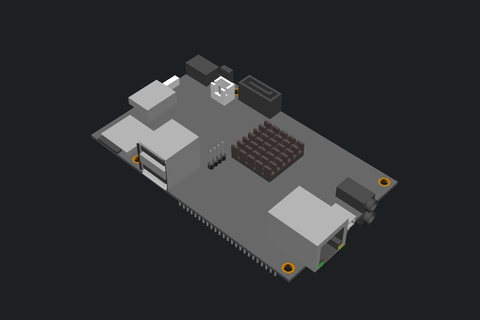
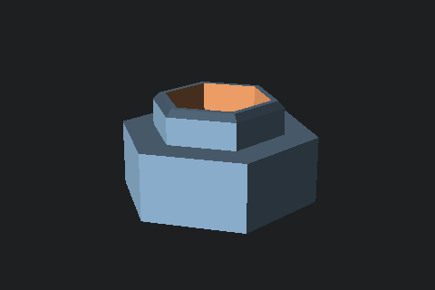
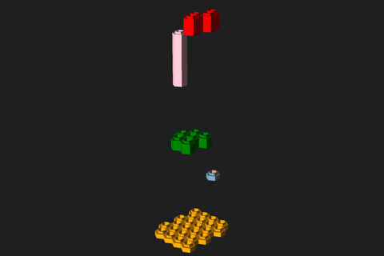
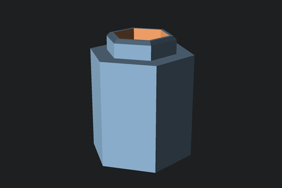
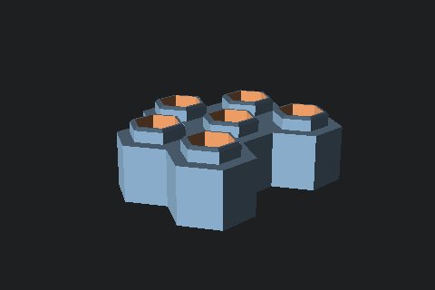
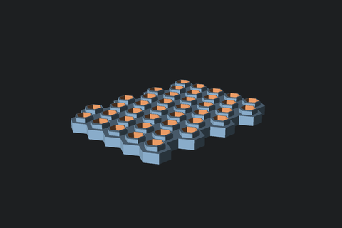

This repository contains various personal OpenSCAD creations.

Most of the interesting stuff lies in the [printables](printables) directory.

**Note**: I'm in the process of making and upstreaming all kind of other things
so there currently isn't much to see.

Boards
======

Some ARM board models to be used for case designs:

| Board name                                      | Preview                                      |
| ----------------------------------------------- | -------------------------------------------- |
| [BeagleBone Black](boards/bbb/bbb.scad)         |          |
| [Cubieboard](boards/cubieboard/cubieboard.scad) |  |

Printables
==============

In order to get the `.stl` files of a given project, enter any directory in
[printables](printables/) and type `make`. Specifying jobs to `make` with `-jX`
is supported and recommended.

[Hexago](printables/hexago/hexago.scad)
---------------------------------------

This is a concept block design inspired by LEGO®, but using hexagon as
primitive. I came up with this while designing a mini rack for my ARM boards.

The hole has 2 purposes:
- reduce cost by saving printing material
- allow flexibility of the wall to workaround 3D printers inaccuracies

**Note**: I haven't printed this yet, but I'm assuming it will require some
contact padding adjustment and a good printer.

### Demo

### Usage

- `hexago_block()` creates an arbitrary block of the specified size.
- `hexago_pos()` works similarly to `translate()` in order to place the block
  based on "hexago unit".
- You may want to tweak `hexago_r` and `hexago_thick` to your needs.

### Examples of Hexago at different sizes

[BeagleBone Black case](printables/bbb-case/bbb-case.scad)
----------------------------------------------------------

A 3D printable case for the BeagleBone Black ARM board. It exposes every
device/pin/slot/button interface available.

### Demo

### Parts

This case is made of 2 main parts (top and bottom) and 3 small buttons pushers:

### In real life

Here is one of the use case of this box in real life:

This a simple Wifi hotspot using a wireless USB dongle.

The button pushers are ugly due to manual melting of filament on top of them to
prevent them for jumping around while opening and closing the box (and then I
tried to cover it up with a red marker).

### Configuration

Some configuration you may want to adjust in [bbb-case.scad](printables/bbb-case/bbb-case.scad):

- `has_carrier` controls the presence of the rectangular carrier for fixing it
  to a wall.
- `carrier_screw_head_*` controls the size of the hole for your screw in case
  the carrier is set.
- `case_thickness` could be reasonably changed if needed in order to control
  the overall thickness of the walls.
- `breath_padding` corresponds to the space padding between parts that are not
  supposed to be in contact.
- `contact_padding` is the space padding between parts that are supposed to be
  in contact. It should be set to `0` in theory, but in practice, cheap 3D
  printers tend to drool quite a bit.
